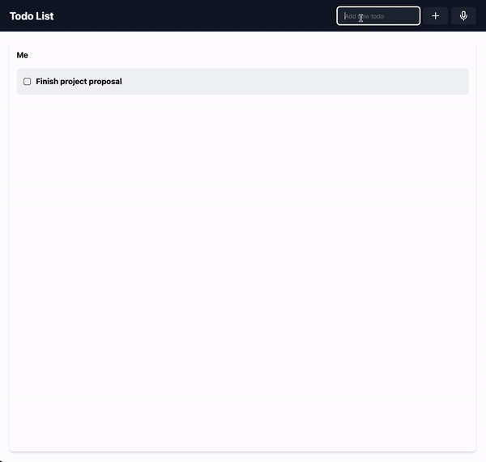

# AI powered todo list

## Setup project

create `.env.local` file in the root according to .env.example and provide your OpenAI API key 

## Start project

In the project directory, you can run:

### `npm start`

